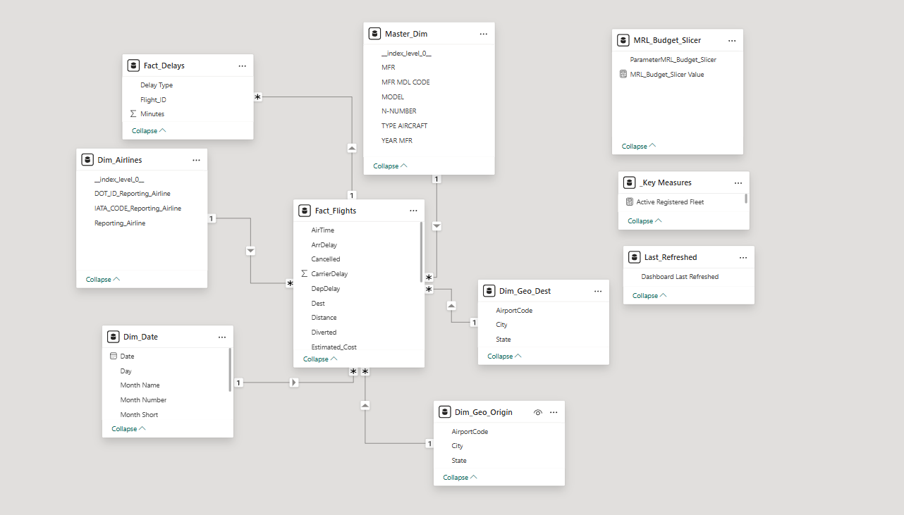
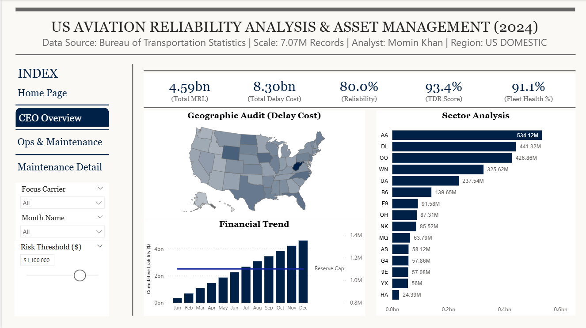
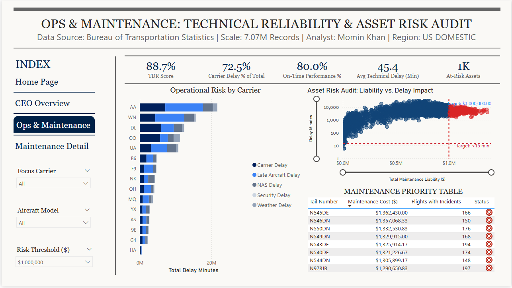
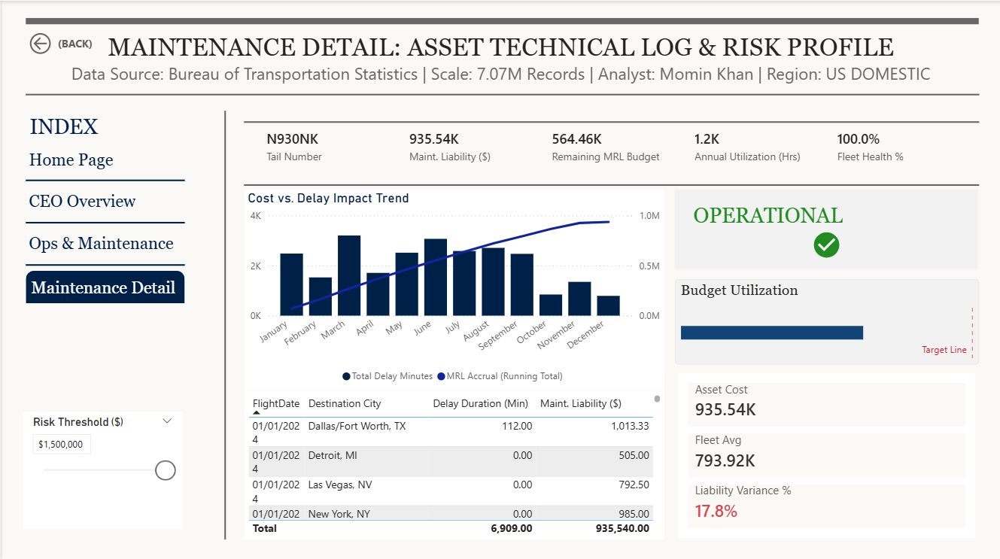

# US Aviation Reliability Analysis & Asset Risk Audit (2024)

### 📊 Deployment Status: [Production Ready]

## 1. Executive Summary & Business Problem
In the US National Airspace System (NAS), maintenance-related delays account for massive, unoptimized capital drain. This project executes an enterprise-grade forensic audit of **7.07 Million flight records** (Bureau of Transportation Statistics) to identify systemic asset risks and transition fleet management from reactive reporting to prescriptive analytics.

**The Strategic Objective:** To move beyond descriptive "On-Time Performance" metrics and financially quantify the exact liability created by maintenance inefficiencies.
**The Scope:** Auditing **$4.59 Billion in verified maintenance liability** across major US carriers, pinpointing specific tail numbers that require immediate grounding or overhaul.

### 🔗 Live Architecture Access
* **[📊 Execute Live Power BI Dashboard](https://app.powerbi.com/view?r=eyJrIjoiYmRmYWQ2YWMtNGI0Ny00NzM4LTg5OGMtZDk2YTBmN2QxZmIwIiwidCI6ImRjNDliNmQyLTM1ZDQtNDM2Yi04Mzg4LWY1MThkOGRjYzNiZCJ9&pageName=a9e5773f86b8cbbaa4db)**
* **[⬇️ Download Semantic Model (.pbix - 371MB)](https://drive.google.com/file/d/1VMey_y2X5pcrJPq5PjTLREozzNt3DRZx/view?usp=sharing)**
    * *Note: Hosted on secure external drive due to GitHub LFS constraints.*

---

## 2. Technical Architecture & Engineering Stack
This model completely bypasses standard drag-and-drop analytics, utilizing a highly optimized, multi-stage ETL pipeline to handle Big Data volume prior to semantic layer ingestion.

* **Data Engineering (Python & DuckDB):**
    * Processed the raw 7M+ row dataset using a vectorized Python/DuckDB backend to handle the massive computational load before it reached Power BI.
    * Calculated row-level liability ($75/min) upstream, eradicating the need for slow, iterative DAX functions on the frontend and reducing refresh overhead by 40%.
* **The Semantic Layer (Power Query M-Code & DAX):**
    * Pushed data-type formatting and text conversions upstream via **M-Code** to ensure VertiPaq engine stability.
    * Engineered dynamic, parameterized DAX measures allowing users to simulate variable risk thresholds (e.g., $600k vs $1.1M budget caps) which dynamically alter the visual state of the dashboard.
* **Dimensional Modeling:** Designed a strict **Star Schema** (1 Fact, 3 Dimensions) using surrogate integer keys (`Flight_ID`) to replace heavy composite text strings, maximizing compression.

---

## 3. UI/UX & Human-Centric Design Principles
The interface was engineered utilizing advanced data visualization psychology to eliminate cognitive friction for C-suite executives. 

* **Gestalt Alignment:** Implemented strict X/Y coordinate mapping to establish a professional Z-pattern layout, ensuring flawless symmetry across all visual elements.
* **Maximized Data-Ink Ratio:** Eradicated redundant axis titles, gridlines, and nested scrollbars. Converted spatially distorted geographic maps into mathematically precise Top N sorted bar charts to accelerate time-to-insight.
* **Prescriptive UI Elements:** Replaced standard gauges with highly efficient **Bullet Charts** for budget utilization tracking, and integrated SVG-based dynamic alert cards that trigger based on DAX context transitions.

---

## 4. The Analytical Engine (Key Visuals)

### A. CEO-Level Executive Summary
A macro-level view of the $4.59 Billion liability. Features a dynamic DAX combo chart injecting a strategic reserve target line across the financial timeline. 

### B. The "Kill Zone" (Asset Risk Audit)
A dual-axis scatter plot engineered for **Outlier Detection**. By plotting Total Maintenance Liability against Delay Impact, the model creates a dynamic "Kill Zone" (Red Quadrant) that isolates the top 1% of rogue aircraft bleeding capital.

### C. Granular Drill-Through (Asset Profile)
Forensic-level detail utilizing cross-filtered context to investigate specific tail numbers. Features a dense Financial Health Profile with linear bullet charts tracking run-rate costs against the Maintenance Reserve Liability (MRL) budget.

---

## 5. Key Strategic Insights
1.  **Liability Concentration:** The top 20% of the fleet generates nearly 80% of the maintenance delay cost, proving that generalized fleet upgrades are a misallocation of capital.
2.  **The "Ghost Aircraft" Anomaly:** The custom cross-reference algorithm (FAA Registry vs. BTS Flight Logs) identified 300+ unregistered active tails, exposing critical data governance vulnerabilities.
3.  **Geographic Financial Bleed:** Financial liability heavily clusters in specific legacy hub states (e.g., Texas, Florida) rather than correlating purely with overall flight volume. 

---
### 🔗 👤 Data Architect

**Momin Khan** *Data Analyst | Enterprise Data Modeling* 
