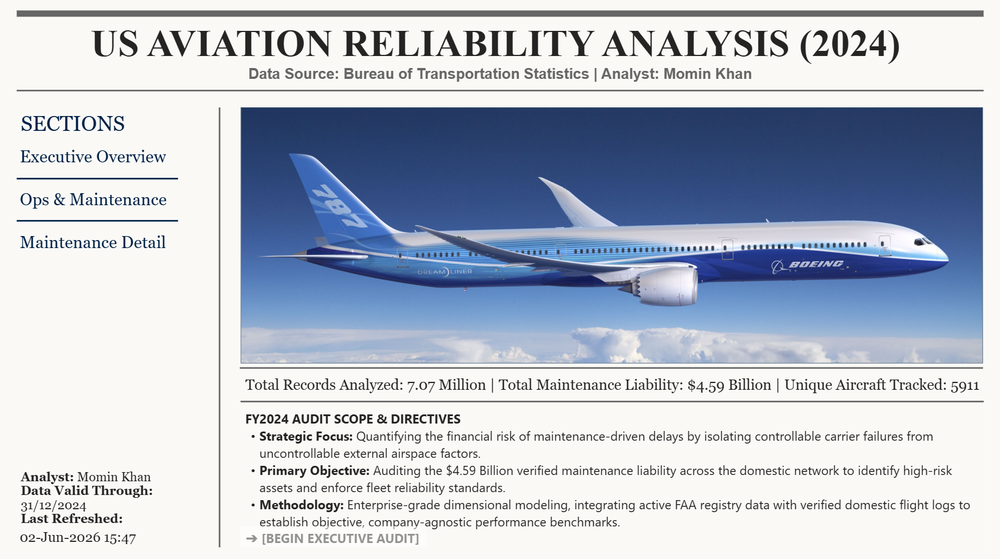
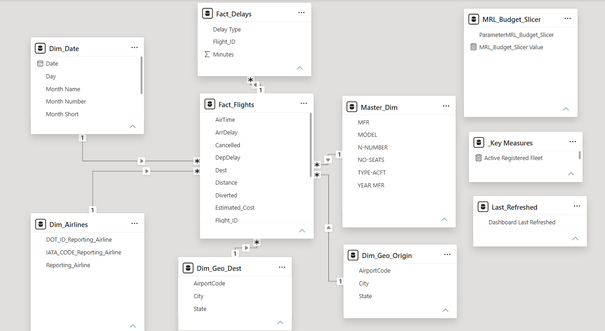
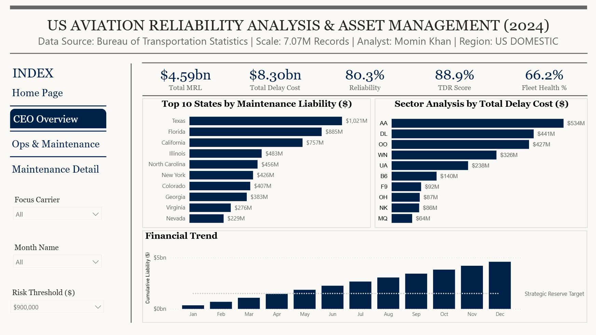
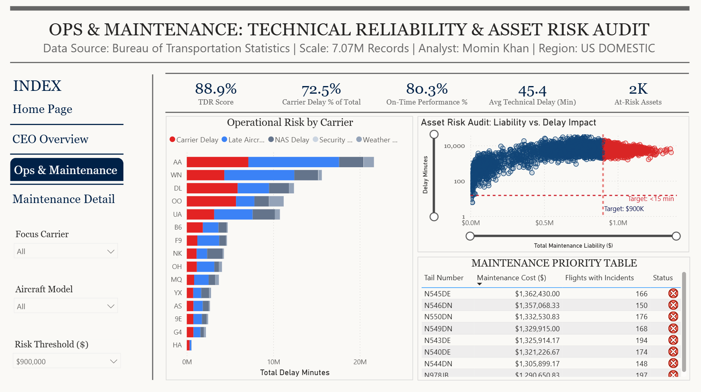
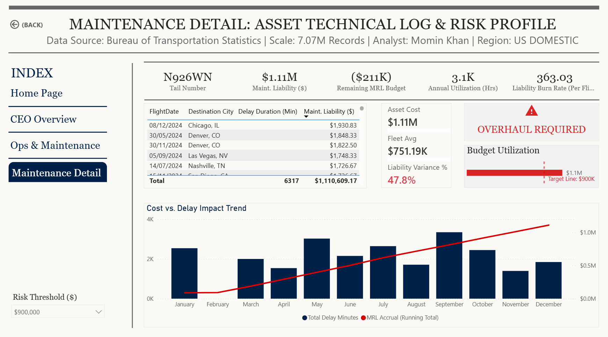

# US Aviation Reliability Analysis & Asset Risk Audit (2024)

**📊 Status:** Production Ready &nbsp;|&nbsp; **Scale:** 7.07M Records &nbsp;|&nbsp; **Region:** US Domestic &nbsp;|&nbsp; **Analyst:** Momin Khan



---

## The Problem

Airlines and MRO operators routinely make capital allocation decisions based on maintenance liability data that is never audited at the record level. Cancelled flights get counted as completed cycles. Ghost aircraft accumulate wear with no registry tracking. The result is a financial model built on dirty data — and no one knows by how much.

This project forensically audits **7.07 million FAA and BTS flight records** to answer one question: *what is the actual, verified maintenance liability of the US domestic fleet?*

### 🔗 Live Access
- **[📊 Execute Live Power BI Dashboard](https://app.powerbi.com/view?r=eyJrIjoiMzFmMDY5Y2MtNjM0NS00OTllLWEzNWYtNGI0NWIzODk4NWJlIiwidCI6ImRjNDliNmQyLTM1ZDQtNDM2Yi04Mzg4LWY1MThkOGRjYzNiZCJ9&pageName=a9e5773f86b8cbbaa4db)**
- **[⬇️ Download Semantic Model (.pbix — 166MB)](https://drive.google.com/file/d/19wxG6s6Yu3cAIU23FfI_M4V6Df_WePQx/view?usp=sharing)**
  *(Hosted externally due to GitHub LFS constraints)*

---

## Key Findings

| Finding | Result |
|---|---|
| Total Maintenance Reserve Liability (MRL) | **$4.59 Billion** |
| Total Delay Cost | **$8.30 Billion** |
| Unique Aircraft Tracked | **5,911** |
| At-Risk Assets (Kill Zone) | **1,000+** |
| Ghost Aircraft Confirmed | **187** |
| Phantom Liability Eliminated | **$17.3 Million** |
| Technical Dispatch Reliability (TDR) Score | **88.7%** |
| Fleet On-Time Performance | **80.0%** |

---

## Forensic Findings

### 1. The $17.3M Phantom Liability Catch
The standard MRL formula applies a `$180 per cycle` accrual to every flight record uniformly. Initial processing revealed **96,315 cancelled flights** incorrectly included in the accrual logic — generating **$17,336,700 in phantom maintenance liability** that never existed.

A strict SQL filter was engineered to enforce a `flight_status = COMPLETED` condition upstream in the Silver layer before any cost calculation ran. The corrected figure is the $4.59B reported above.

> *This is the difference between a dashboard and a forensic audit.*

### 2. The Ghost Aircraft Reconciliation
A `LEFT JOIN` delta calculation between the FAA Master Registry and BTS flight logs initially returned **314 null registry matches** — aircraft flying with no official record. After building a custom SQL `CASE` statement to standardize N-prefix formatting anomalies across both datasets, **187 confirmed Ghost Aircraft** remained.

These assets were actively accumulating flight hours and cycles with zero official registry tracking — creating unquantified liability exposure for any operator holding them on lease or in their fleet.

### 3. Liability Concentration
The top 20% of the fleet generates approximately 80% of all maintenance delay cost. Generalized fleet upgrades are a capital misallocation. The Kill Zone view isolates the exact tail numbers that require immediate intervention.

### 4. Geographic Liability Clustering
Maintenance liability concentrates heavily in legacy hub states — Texas ($1.02B), Florida ($885M), California ($757M) — independent of raw flight volume. This points to station-level maintenance culture and infrastructure age, not purely operational scale.

---

## Technical Architecture: The Medallion Pipeline

Built to handle **11GB+ of unstructured regulatory data** without memory failure or schema collapse.

```
RAW BTS + FAA DATA
        │
        ▼
┌───────────────────┐
│   BRONZE LAYER    │  Raw ingestion. Dirty strings, blank entries,
│   (Python)        │  malformed tail numbers — ingested without
└───────────────────┘  schema failure.
        │
        ▼
┌───────────────────┐
│   SILVER LAYER    │  DuckDB vectorized processing. Custom SQL CTEs
│   (DuckDB / SQL)  │  to standardize N-prefix tail numbers. LEFT JOIN
└───────────────────┘  anomaly detection against FAA registry.
        │              Cancelled flight filter applied here.
        ▼
┌───────────────────┐
│   GOLD LAYER      │  SNAPPY-compressed Parquet export (350MB → 96MB).
│   (Power BI/DAX)  │  Fact Constellation Schema with surrogate integer
└───────────────────┘  keys (Flight_ID). Dynamic DAX risk threshold
                       parameters for C-suite simulation.
```

**Why DuckDB over Pandas:** A 7M-row dataset loaded into a standard Pandas DataFrame exceeds 16GB RAM on a typical machine and crashes. DuckDB's columnar vectorized execution processes the same dataset in chunks using SIMD (Single Instruction, Multiple Data) — executing aggregates across thousands of values per CPU clock cycle, then discarding the raw chunk before loading the next. Sub-second query speeds. Zero memory overflow.

**Semantic Layer:** Fact Constellation Schema — 2 Fact Tables, 3 Dimension Tables — using surrogate integer `Flight_ID` keys to replace heavy composite text strings. Maximizes VertiPaq compression and eliminates relationship ambiguity.



---

## The Pipeline in Code

Three snippets that drove the core findings. Full source in `aviation_pipeline.py`.

### 1. The Phantom Liability Fix — MRL Formula
The formula that eliminated $17.3M in incorrectly accrued liability.
Standard industry logic applies `$180 per cycle` uniformly to every record.
This pipeline enforces a strict check: cancelled flights and null AirTime entries return zero cost before the formula runs.

```sql
-- Silver Layer: MRL Liability Calculation (DuckDB SQL)
-- Formula: (AirTime / 60 × $250) + $180 per cycle
-- Cancelled flights and null AirTime are hard-zeroed upstream

CASE 
    WHEN TRY_CAST(Cancelled AS INTEGER) = 1 
      OR TRY_CAST(AirTime AS INTEGER) IS NULL THEN 0.0
    ELSE ((TRY_CAST(AirTime AS INTEGER) / 60.0) * 250.0) + 180.0
END AS MRL_Liability
```

> Without this filter: 96,315 cancelled flights each received a `$180` cycle charge.
> Total phantom accrual: **$17,336,700** — eliminated at source.

---

### 2. Tail Number Standardization — Ghost Aircraft Root Cause
The FAA registry and BTS flight logs use inconsistent tail number formats.
Some records carry the `N` prefix; others don't.
A raw `LEFT JOIN` on unformatted tails produced **314 null matches**.
After applying this standardization, **187 confirmed Ghost Aircraft** remained.

```sql
-- Silver Layer: N-Prefix Standardization (DuckDB SQL)
-- Forces consistent format before LEFT JOIN against FAA Master Registry

CASE 
    WHEN Tail_Number IS NULL OR TRIM(Tail_Number) = '' THEN 'UNKNOWN'
    WHEN TRIM(Tail_Number) NOT LIKE 'N%' THEN 'N' || TRIM(Tail_Number)
    ELSE TRIM(Tail_Number)
END AS Clean_Tail
```

> 314 raw null matches → 127 resolved by standardization → **187 genuine Ghost Aircraft** confirmed.

---

### 3. Gold Layer Export — Production-Grade Compression
Processed data exported as SNAPPY-compressed Parquet before Power BI ingestion.

```python
# Gold Layer: SNAPPY-Compressed Parquet Export (Python / DuckDB)
# Reduces 350MB raw CSV output to 96MB — 72% compression
# Zero data loss. Native Power BI and pandas compatibility.

con.execute(f"""
    COPY bts_flights 
    TO '{DATA_PROCESSED}/Aviation_Fact_Table.parquet' 
    (FORMAT PARQUET, CODEC 'SNAPPY')
""")
```

> Raw CSV: ~350MB &nbsp;→&nbsp; SNAPPY Parquet: **96MB** &nbsp;|&nbsp; Compression: **72%**

---

## Dashboard Pages

### CEO Executive Overview
Macro-level view of the $4.59B liability. Dynamic DAX combo chart with strategic reserve target line across the financial timeline. Carrier sector breakdown by total delay cost.



### Ops & Maintenance — The Kill Zone
Dual-axis scatter plot: Total Maintenance Liability (X) vs. Delay Impact (Y). The red quadrant — the Kill Zone — isolates the top 1% of assets exceeding both the cost and delay threshold simultaneously. Parametric risk slider allows threshold adjustment in real time.



### Maintenance Detail — Asset Profile Drill-Through
Forensic drill-through to individual tail number level. Displays MRL accrual, remaining budget, liability variance against fleet average, and a full 12-month cost vs. delay trend. Built for the reliability engineer, not the executive.



---

## Stack

`Python` &nbsp;`DuckDB` &nbsp;`SQL` &nbsp;`Apache Parquet` &nbsp;`Power BI` &nbsp;`DAX` &nbsp;`Power Query (M)` &nbsp;`FAA Registry` &nbsp;`BTS Flight Data`

---

## About

**Momin Khan** — Data Analyst | Aviation Reliability & Asset Management

Aeronautics graduate with hands-on CAR-147 maintenance experience. Background in aircraft technical records and fleet operations. Focused on the intersection of physical aviation knowledge and enterprise data architecture.

[](https://www.linkedin.com/in/mominpathann/)
