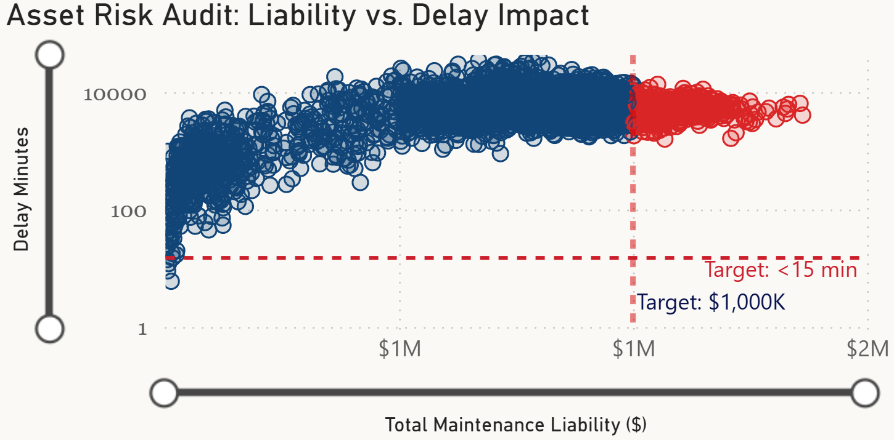
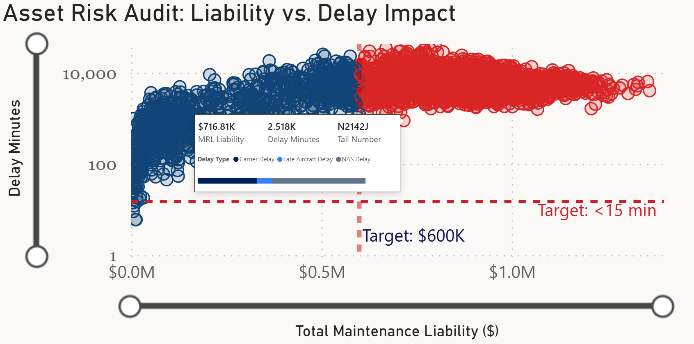
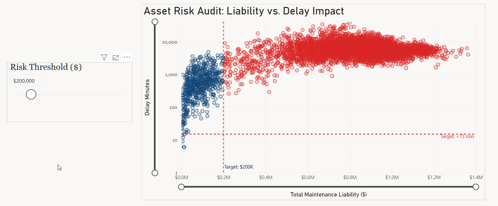
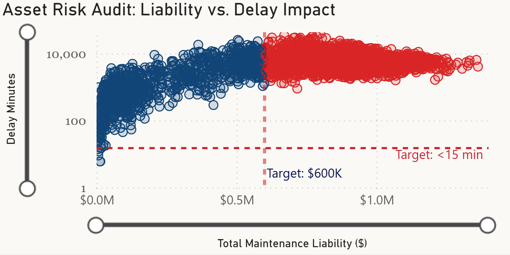
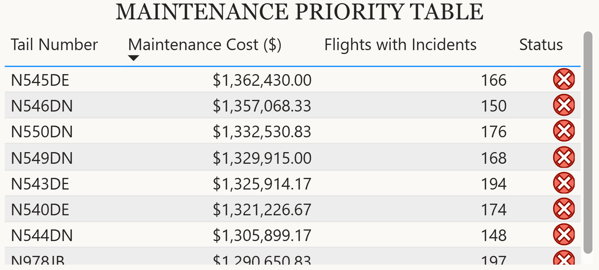

# US Aviation Reliability Analysis & Asset Risk Audit (2024)


**Analyst:** Momin Khan &nbsp;|&nbsp; **Region:** US Domestic &nbsp;|&nbsp; **Data Valid Through:** 31/12/2024


---

## The Problem

Airlines and MRO operators routinely make capital allocation decisions based on maintenance liability data that is never audited at the record level. Cancelled flights get counted as completed cycles. Ghost aircraft accumulate wear with no registry tracking. The result is a financial model built on dirty data — and no one knows by how much.

This project forensically audits **7.07 million BTS flight records** against the FAA Master Registry to answer one question: *what is the actual, verified maintenance liability of the US domestic fleet?*

### 🔗 Live Access
- **[📊 Execute Live Power BI Dashboard](https://app.powerbi.com/view?r=eyJrIjoiMGQwODlmZTMtZDhhZC00OTdiLTkwMzEtMzU2NmI1MTIzNGM5IiwidCI6ImRjNDliNmQyLTM1ZDQtNDM2Yi04Mzg4LWY1MThkOGRjYzNiZCJ9&pageName=a9e5773f86b8cbbaa4db)**
- **[⬇️ Download Semantic Model (.pbix — 162MB)](https://drive.google.com/file/d/1Jn2ic9zBBKTeIszjdn6WQqqnmo916Mdr/view?usp=drive_link)**
  *(Hosted externally due to GitHub LFS constraints)*

---

## Key Findings

| Metric | Value |
|---|---|
| Total Maintenance Reserve Liability (MRL) | **$4.59 Billion** |
| Total Delay Cost | **$8.30 Billion** |
| Unique Registered Aircraft | **5,911** |
| Carriers Audited | **15** |
| Airports in Network | **348** |
| At-Risk Assets (Kill Zone) | **2,000+** |
| Ghost Aircraft Confirmed | **199** |
| Phantom Liability Eliminated | **$17.3 Million** |
| Technical Dispatch Reliability (TDR) | **88.9%** |
| On-Time Performance (OTP) | **80.3%** |
| Fleet Health % | **66.2%** |
| Carrier Delay % of Total | **72.5%** |
| Avg Technical Delay | **45.4 min** |

---

## Dashboard Capabilities

This is not a static report. Every metric in the dashboard responds to user-controlled parameters through engineered DAX context transitions.

**Dynamic Risk Classification (Kill Zone)**
A parametric MRL threshold slicer re-classifies the entire fleet in real time — shifting aircraft from safe (navy) to at-risk (red) as the budget threshold changes. Implemented via DAX `FILTER` + `SELECTEDVALUE` context propagation across 7M records.

**Asset-Level Drill-Through**
Any tail number in the Kill Zone can be drilled through to a dedicated asset profile showing: MRL liability, remaining reserve budget, 12-month accrual trend, liability variance vs. fleet average, and OVERHAUL REQUIRED / OPERATIONAL status — computed live via DAX.

**Carrier vs. Uncontrollable Delay Decomposition**
The dashboard isolates carrier-controllable delays (72.5% of total) from external factors (weather, NAS, security). This is the core financial accountability metric — it tells operators exactly which delays they could have prevented.

**Months to Inflection**
A forward-looking DAX measure that calculates how many months remain before cumulative MRL accrual burns through the strategic reserve — based on current burn rate trends.

---

## The Kill Zone

The Kill Zone is the primary analytical output of this project. It is a dual-axis scatter plot — Total Maintenance Liability (X) vs. Total Delay Impact (Y) — that isolates the top 1% of assets simultaneously exceeding both the cost and delay threshold.



Every dot is a tail number. Navy dots are within budget. Red dots have crossed the MRL threshold — these are the assets requiring immediate intervention.

The dashed lines are not decorative. They are live Power BI parameters. Move the Risk Threshold slicer and the entire red cluster shifts.



Hovering over any red dot surfaces the aircraft's full operational profile: MRL liability, total delay minutes, and delay cause breakdown — all computed in real time from the 7M-row dataset.

### Dynamic Threshold Demo



Moving the risk threshold from $600K to $1.2M reclassifies the entire fleet in under a second. This is not a filter — it is a live DAX parameter changing the color logic, the priority table, and the at-risk count simultaneously across all visuals on the page.

### Threshold Shift



### Maintenance Priority Table

The scatter drives a ranked priority table — the highest-liability aircraft that exceed the threshold are surfaced automatically, sorted by maintenance cost with live OVERHAUL REQUIRED status icons.



---

## Forensic Findings

### 1. The $17.3M Phantom Liability Catch

The standard MRL formula applies a `$180 per cycle` charge to every flight record uniformly. Initial processing revealed **96,315 cancelled flights** incorrectly included in the accrual logic — generating **$17,336,700 in phantom maintenance liability** that never existed.

The pipeline enforces a hard-zero on cancelled flights and null AirTime records upstream in the Silver layer, before any cost calculation runs.

> *This is the difference between a dashboard and a forensic audit.*

---

### 2. The Ghost Aircraft Reconciliation

Cross-referencing BTS flight logs against the FAA Master Registry initially produced **314 null matches** — aircraft flying with no official record. Root cause: inconsistent N-prefix formatting across the two datasets. After standardization on both sides:

**314 raw nulls → 115 resolved by standardization → 199 confirmed Ghost Aircraft**

These 199 assets were actively accumulating flight hours and cycles with zero official registry tracking — creating unquantified liability exposure for any operator holding them on lease.

---

### 3. Carrier Controllability: 72.5% of Delays Are Preventable

The delay decomposition reveals that **72.5% of all delay minutes are carrier-controllable** — meaning the airline itself is operationally responsible, not weather, ATC, or security. This is the most actionable finding in the dataset. Capital should not be allocated to uncontrollable events.

---

### 4. Liability Concentration

The top 20% of the fleet generates approximately 80% of all maintenance delay cost. The Kill Zone isolates the exact tail numbers requiring immediate intervention — generalized fleet upgrades are a capital misallocation.

---

### 5. Geographic Liability Clustering

Maintenance liability concentrates in legacy hub states — Texas ($1.02B), Florida ($885M), California ($757M) — independently of raw flight volume. This points to station-level maintenance culture and infrastructure age, not purely operational scale.

---

## Dashboard Pages

### Cover Page & Audit Scope


### CEO Executive Overview

Macro-level view of the $4.59B liability. Dynamic DAX combo chart with $1.5B strategic reserve target line. Carrier sector breakdown by total delay cost. Financial trend shows cumulative MRL accrual through FY2024.


### Ops & Maintenance — Kill Zone & Priority Table

Full scatter plot, operational risk by carrier, and ranked maintenance priority table. All visuals respond to the Risk Threshold slicer.


### Maintenance Detail — Asset Technical Log & Risk Profile

Forensic drill-through to individual tail number. MRL accrual, remaining budget, liability variance vs. fleet average, 12-month cost vs. delay trend, and live OVERHAUL REQUIRED / OPERATIONAL status.


---

## Technical Architecture: The Medallion Pipeline

Built to handle **11GB+ of unstructured regulatory data** without memory failure or schema collapse.

```
RAW BTS + FAA DATA  (12 monthly ZIPs + MASTER.txt + ACFTREF.txt)
         │
         ▼
┌─────────────────────┐
│   BRONZE LAYER      │  Monthly BTS ZIPs downloaded with retry logic.
│   download_and_     │  CSVs extracted. Dirty strings, blank entries,
│   extract()         │  and malformed tail numbers ingested without
└─────────────────────┘  schema failure.
         │
         ▼
┌─────────────────────┐
│   SILVER LAYER      │  DuckDB vectorized ETL on 7.07M rows.
│   run_silver_       │  N-prefix tail standardization. Corrected MRL
│   pipeline()        │  formula (cancelled flights hard-zeroed).
└─────────────────────┘  Star schema extracted: 2 fact tables,
                         3 dimension tables. SNAPPY Parquet export.
         │
         ▼
┌─────────────────────┐
│   AUDIT LAYER       │  Python set difference: active_fleet − registered.
│   run_ghost_        │  FAA MASTER.txt + ACFTREF.txt merged for enriched
│   aircraft_audit()  │  aircraft profiles. 199 ghost aircraft confirmed.
└─────────────────────┘
         │
         ▼
┌─────────────────────┐
│   GOLD LAYER        │  6x SNAPPY-compressed Parquet files.
│   Power BI / DAX    │  Fact Constellation Schema. 40+ DAX measures.
└─────────────────────┘  Dynamic parametric risk simulation.
```

**Why DuckDB over Pandas:**
A 7M-row dataset loaded into a Pandas DataFrame requires 16GB+ RAM and crashes standard machines. DuckDB's columnar vectorized engine uses SIMD (Single Instruction, Multiple Data) — processing data in memory-efficient chunks, executing aggregates across thousands of values per CPU clock cycle, then discarding raw chunks before loading the next. Sub-second query speeds. Zero memory overflow.

---

## The Pipeline in Code

### 1. Corrected MRL Formula — $17.3M Phantom Liability Eliminated

```sql
-- Silver Layer: run_silver_pipeline() — DuckDB SQL
-- MRL Formula: (AirTime / 60 × $250) + $180 per cycle
-- Cancelled flights and null AirTime → hard-zeroed before calculation

CASE
    WHEN TRY_CAST(Cancelled AS INTEGER) = 1
      OR TRY_CAST(AirTime   AS INTEGER) IS NULL THEN 0.0
    ELSE ((TRY_CAST(AirTime AS INTEGER) / 60.0) * 250.0) + 180.0
END AS MRL_Liability
```

> 96,315 cancelled flights × $180 = **$17,336,700 eliminated at source.**

---

### 2. Tail Number Standardization — Ghost Aircraft Root Cause Fix

```sql
-- Silver Layer: run_silver_pipeline() — DuckDB SQL
-- Forces N-prefix consistency before FAA registry comparison
-- Without this: 314 null matches. After: 199 confirmed ghost aircraft.

CASE
    WHEN Tail_Number IS NULL OR TRIM(Tail_Number) = '' THEN 'UNKNOWN'
    WHEN TRIM(Tail_Number) NOT LIKE 'N%%' THEN 'N' || TRIM(Tail_Number)
    ELSE TRIM(Tail_Number)
END AS Tail_Number
```

> 314 raw nulls → 115 resolved by standardization → **199 genuine Ghost Aircraft confirmed.**

---

### 3. Ghost Aircraft Detection — Set Difference Audit

```python
# Audit Layer: run_ghost_aircraft_audit()
# Set difference: tail numbers flying in BTS with NO FAA registry match

active_fleet = set(fact_tails['Tail_Number'].dropna().apply(clean_tail))
registered   = set(merged_master['N-NUMBER_CLEAN'].dropna())

orphans = active_fleet - registered
# Output: 199 confirmed Ghost Aircraft → Ghost_Aircraft_Audit.parquet
```

---

### 4. Unpivoted Delay Fact Table — Power BI Optimized

```sql
-- Silver Layer: Transforms 5 delay columns into 2,354,307 rows
-- Enables simple SUM(Minutes) by Delay Type in DAX

WITH unpivoted_delays AS (
    UNPIVOT bts_flights
    ON CarrierDelay AS 'Carrier Delay',
       WeatherDelay AS 'Weather Delay',
       NASDelay AS 'NAS Delay',
       SecurityDelay AS 'Security Delay',
       LateAircraftDelay AS 'Late Aircraft Delay'
    INTO NAME "Delay Type" VALUE "Minutes"
)
SELECT Flight_ID, "Delay Type", TRY_CAST("Minutes" AS INTEGER) AS "Minutes"
FROM unpivoted_delays
WHERE "Minutes" > 0
```

---

## DAX Measures: The Analytical Engine

40+ custom DAX measures power the dashboard. Five that define its analytical depth:

**`Months to Inflection`**
Predicts how many months remain before cumulative MRL accrual burns through the $1.5B strategic reserve, based on current 30-day burn rate. A forward-looking risk signal, not a rear-view metric.

**`Liability Burn Rate (per flight hour)`**
Calculates the MRL cost accruing per flight hour for any selected aircraft. Surfaces which assets are degrading fastest relative to their utilization.

**`Scatter Color Logic`**
Dynamic DAX color classification driving the Kill Zone. Every dot in the scatter evaluates `[True Total MRL Liability] > [MRL_Budget_Slicer Value]` in real time — returning `#D92525` (red) or `#114477` (navy) per aircraft, per threshold change.

**`Controllability Ratio`**
Isolates carrier-controllable delay cost from external (weather, NAS, security) delay cost. The 72.5% figure comes from this measure — the accountability metric that drives operational intervention decisions.

**`Fleet Health %`**
Parametric health score: the percentage of registered aircraft currently under the MRL threshold. At the default $900K threshold, Fleet Health is **66.2%** — meaning 1 in 3 aircraft in the active fleet is over budget.

---

## Output Schema

Six SNAPPY-compressed Parquet files exported to `/data_processed/`:

| File | Rows | Columns | Description |
|---|---|---|---|
| `Aviation_Fact_Table.parquet` | 7,079,061 | 15 | Core flight metrics, MRL liability, delay cost |
| `Aviation_Fact_Delay_Table.parquet` | 2,354,307 | 3 | Unpivoted delay cause breakdown |
| `Aviation_Airlines_Dim.parquet` | 15 | 3 | Carrier codes and DOT/IATA identifiers |
| `Aviation_Geo_Dim.parquet` | 348 | 3 | Airport codes, cities, and states |
| `Master_Dim.parquet` | 5,913 | 6 | FAA registry: type, manufacturer, model, seats |
| `Ghost_Aircraft_Audit.parquet` | 199 | 1 | Unregistered tail numbers confirmed flying 2024 |

**Schema: Fact Constellation (2 Fact Tables, 3 Dimension Tables)**


```
Aviation_Fact_Table ──── Reporting_Airline ──── Aviation_Airlines_Dim
        │
        ├── Flight_ID ──────────────────────── Aviation_Fact_Delay_Table
        │
        ├── Tail_Number ────────────────────── Master_Dim
        │
        └── Origin / Dest ──────────────────── Aviation_Geo_Dim
```

---

## Repository Structure

```
us-aviation-reliability-audit-2024/
│
├── README.md
├── requirements.txt
├── .gitignore
├── LICENSE
│
├── main_pipeline.py                      ← Full Medallion ETL pipeline
│
└── assets/
    ├── 01_project_cover.png
    ├── 02_executive_summary.png
    ├── 03_asset_risk_audit.png
    ├── 04_maintenance_detail.png
    ├── 05_star_schema_model.png
    ├── 06_kill_zone_clean.png            ← Kill Zone scatter, clean state
    ├── 07_kill_zone_tooltip.png          ← Individual aircraft tooltip
    ├── 08_threshold_shift.png            ← Dynamic threshold reclassification
    ├── 09_priority_table.png             ← Maintenance Priority Table
    └── kill_zone_demo.gif                ← Live threshold demo
```

---

## How to Run

```bash
# 1. Clone the repository
git clone https://github.com/MominPathann/US-Aviation-Reliability-Audit.git
cd US-Aviation-Reliability-Audit

# 2. Install dependencies
pip install -r requirements.txt

# 3. Place FAA registry files in data_raw/
#    Download: https://registry.faa.gov/database/ReleasableAircraft.zip
#    Extract MASTER.txt and ACFTREF.txt into data_raw/

# 4. Run the pipeline
python main_pipeline.py

# Note: BTS data download is commented out by default.
# To download 12 months of raw BTS flight data (~11GB), uncomment:
# download_and_extract()
```

**Expected outputs in `/data_processed/`:**

| File | Rows | Description |
|---|---|---|
| `Aviation_Fact_Table.parquet` | 7,079,061 | Core flight data |
| `Aviation_Fact_Delay_Table.parquet` | 2,354,307 | Delay cause breakdown |
| `Aviation_Airlines_Dim.parquet` | 15 | Carrier reference |
| `Aviation_Geo_Dim.parquet` | 348 | Airport reference |
| `Master_Dim.parquet` | 5,913 | Matched FAA aircraft registry |
| `Ghost_Aircraft_Audit.parquet` | 199 | Unregistered tail numbers |

---

## Stack

`Python` &nbsp;`DuckDB` &nbsp;`SQL` &nbsp;`Pandas` &nbsp;`Apache Parquet` &nbsp;`Power BI` &nbsp;`DAX` &nbsp;`Power Query (M)` &nbsp;`FAA Registry` &nbsp;`BTS Flight Data`

---

## About

**Momin Khan** — Data Analyst | Aviation Reliability & Asset Management

Aeronautics graduate with hands-on CAR-147 maintenance experience. Background in aircraft technical records and fleet operations. Focused on the intersection of physical aviation knowledge and enterprise data architecture.

[](https://www.linkedin.com/in/mominpathann/)
